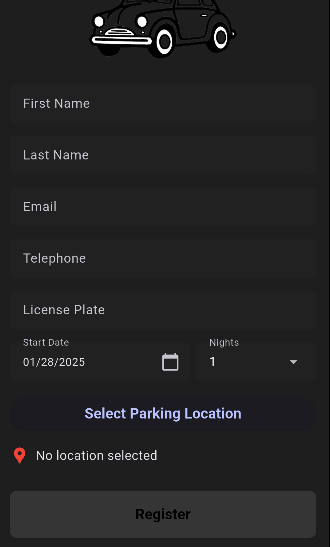
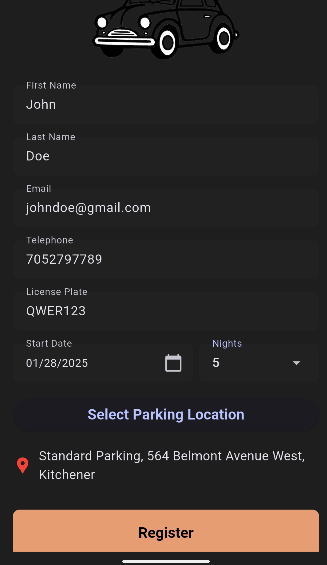
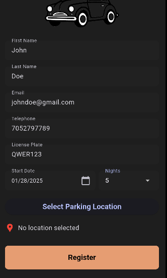
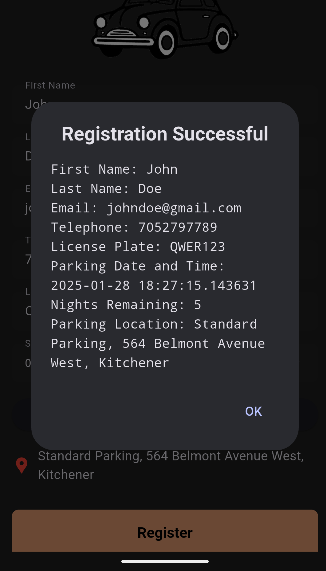
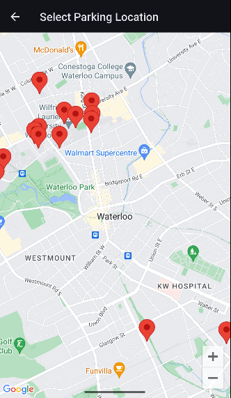
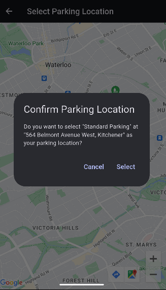

# FirstUse Parking App



FirstUse Parking App is a user-friendly mobile application designed to streamline parking management. Users can select parking locations, register their vehicles, and manage parking durations effortlessly.

## Table of Contents

1. [Features](#features)
2. [Requirements](#requirements)
3. [Installation](#installation)
4. [Usage](#usage)
5. [Screenshots](#screenshots)
6. [Contributing](#contributing)
7. [License](#license)

## Features

- Simple and intuitive user interface
- Select parking locations via an interactive map
- Register vehicles with essential details like license plate and duration
- Input validation for fields such as email and phone number
- Dynamic confirmation dialogs for parking location selections
- Overview of registration details after successful submission

## Requirements

- Android device or emulator
- Android Studio (for development purposes)

## Installation

1. Clone the repository:

   ```bash
   git clone https://github.com/liamc-code/FirstUse_Parking_App.git
   ```

2. Open the project in Android Studio.

3. Build and run the project on your preferred emulator or connected Android device.

## Usage

1. **Register Vehicle**:
   - Fill in the required fields: first name, last name, email, phone number, license plate, and parking duration.
   - Select a parking location from the map.
   - Click "Register" to complete the registration process.

2. **Select Parking Location**:
   - Navigate to the map view and select a parking location.
   - Confirm the parking location in the dialog box.

3. **Input Validation**:
   - Ensure correct formatting for all fields. Invalid inputs will prompt error messages.

4. **View Registration Details**:
   - After registration, a confirmation dialog displays all submitted details.

## Screenshots

### Initial Homepage


### Filled-In Registration with Location


### Filled-In Registration without Location


### Registration Success Dialog


### Select Parking Location


### Confirm Parking Location


## License

FirstUse Parking App is released under the [MIT License](./LICENSE).
